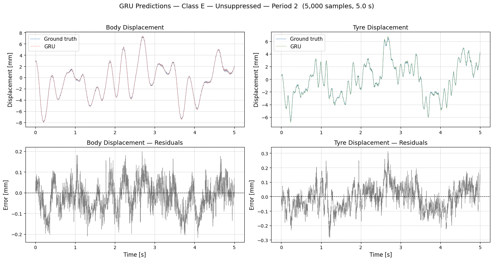
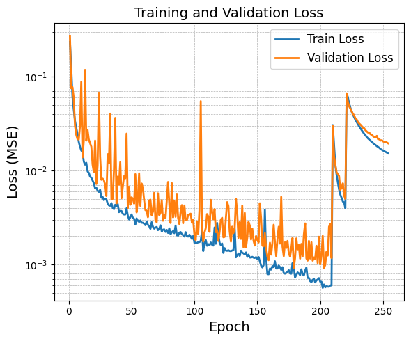
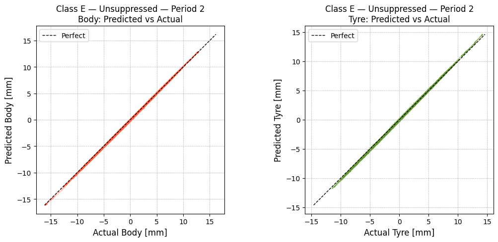
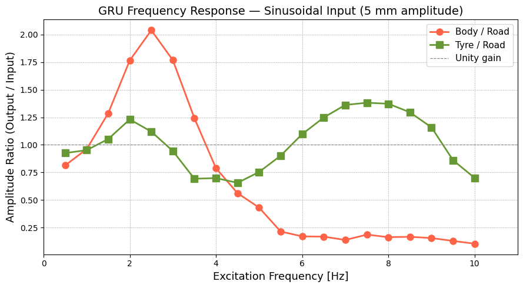

# Suspension Displacement Prediction — GRU

> A recurrent neural network that predicts vehicle body and tyre displacement directly from a road profile, learned from Quanser active-suspension bench data with no physical parameters supplied.

---

## Overview

**The problem:** Predicting how a suspension responds to the road is a core vehicle-dynamics task, and the standard tool is the quarter-car model. It is cheap and interpretable, but it requires accurate mass/stiffness/damping values and it assumes all behaviour is linear. Real suspensions have bushings, friction, and travel limits that introduce nonlinearity a linear model cannot represent. The objective of this project is to predict body and tyre displacement simultaneously from road elevation alone, without identifying any physical parameters.

**The approach:** A GRU-based recurrent network maps a sliding 1,000-sample window of ISO 8608 road elevation (1 second of road history at 1 kHz) to the body and tyre displacement at the end of that window. Two stacked GRU layers compress the road history into a hidden state, and a three-layer MLP decodes it into the two displacements. I chose a GRU over a plain RNN because suspension response depends on road history over hundreds of milliseconds, which is exactly the range where a vanilla RNN's gradients vanish. Training uses all five roughness classes at once, with global z-score normalisation — MinMax scaling failed because Class E amplitudes are roughly an order of magnitude larger than Class A, so a shared MinMax range squashed the smooth roads to nearly nothing and gave poor accuracy on smoother roads.

**Outcome:** Correlation with ground truth is >= 0.997 on every road class, and body RMSE stays between 0.020 mm (Class A) and 0.071 mm (Class E) against displacements measured in millimetres. More telling than the error numbers: the model behaves sensibly on inputs it never saw in training — speed bumps, potholes, and sine sweeps all produce physically plausible responses, and a frequency sweep recovers the suspension's two natural resonances even though it was only ever trained on broadband road data.

---

## Results

Evaluated on the held-out period of each ISO 8608 class, denormalised back to metres before scoring. All figures and metrics below come from the checkpoint `gru_bs128_s5_seq1000_100k.pt` — batch size 128, stride 5, a 1,000-sample window, trained on the full 100,000 samples per class.

**Body displacement**

| Class | RMSE [mm] | MAE [mm] | NRMSE / range | NRMSE / std | Correlation |
|---|---|---|---|---|---|
| A | 0.0204 | 0.0173 | 1.81 % | 13.28 % | 0.9970 |
| B | 0.0234 | 0.0194 | 0.88 % | 6.14 % | 0.9993 |
| C | 0.0293 | 0.0230 | 0.53 % | 3.91 % | 0.9996 |
| D | 0.0482 | 0.0380 | 0.36 % | 2.84 % | 0.9998 |
| E | 0.0709 | 0.0555 | 0.24 % | 1.99 % | 0.9999 |

**Tyre displacement**

| Class | RMSE [mm] | MAE [mm] | NRMSE / range | NRMSE / std | Correlation |
|---|---|---|---|---|---|
| A | 0.0142 | 0.0112 | 0.91 % | 6.62 % | 0.9983 |
| B | 0.0207 | 0.0162 | 0.60 % | 4.36 % | 0.9995 |
| C | 0.0360 | 0.0282 | 0.56 % | 4.16 % | 0.9996 |
| D | 0.0623 | 0.0494 | 0.50 % | 3.65 % | 0.9997 |
| E | 0.1002 | 0.0786 | 0.39 % | 2.98 % | 0.9998 |

RMSE and MAE are absolute errors in millimetres; NRMSE normalises them by the signal's range and by its standard deviation, so those columns are comparable across classes in a way the raw errors are not.

Absolute error grows with roughness, but *relative* accuracy moves the other way — and the NRMSE/std column makes it quantitative. Body error normalised by signal spread is 13.3 % on Class A against 1.99 % on Class E, about a sevenfold gap, even though Class A has the smallest RMSE in millimetres. The reason is that Class E's much larger displacements dominate the MSE during training, so the loss has little incentive to resolve Class A's small-amplitude detail. This shows up as a slight negative bias on the smoothest profiles and is the clearest target for the next round of work. The tyre channel is tighter across the board (6.6 % down to 3.0 % NRMSE/std) because tyre displacement tracks the road more directly and has less of the delayed, filtered dynamics that make the body harder to predict.

Training was stopped when the validation loss spiked rather than letting the early-stopping counter run out; the best checkpoint by validation MSE is the one kept.

The parity plot shows the errors are unbiased and evenly spread rather than concentrated at the extremes of travel — the model is not simply clipping large excursions.

### A learned transfer function

The strongest evidence that the network learned suspension *dynamics*, rather than memorising the training signals, comes from driving it with pure sinusoids — inputs it never saw during training, since every training profile was a broadband ISO 8608 road. Sweeping a 5 mm sine from 0.5 Hz to 10 Hz and measuring the steady-state output/input amplitude ratio recovers the frequency response below.

Two features stand out, and both are exactly what a two-mass suspension should produce:

- **The body isolates high-frequency road input.** The body/road ratio rises to a resonant peak near 2 Hz — the sprung-mass natural frequency — where road input is *amplified* roughly two-fold, then rolls off steeply, falling below 0.15 above 6 Hz. That roll-off is the entire purpose of a suspension: pass almost nothing at high frequency so the cabin stays still while the wheel absorbs the road.
- **The tyre carries a second resonance.** The tyre/road ratio shows the same low-frequency peak near 2 Hz, dips through an anti-resonance around 3.5 Hz, then rises to a second broad peak near 7.5–8 Hz. That upper peak is the wheel-hop mode — the unsprung mass bouncing on the tyre's own stiffness — and the tyre stays close to unity gain across a wide band because it tracks the road far more directly than the body does.

A physical quarter-car has precisely two resonances, one for each mass, and both appear here at sensible frequencies with the correct relative behaviour. The model was never given a spring rate, a damping coefficient, or a single sinusoid; it reconstructed the system's modal structure from road-elevation data alone.

**Reproducing the headline numbers:** the results table uses `SEQ_LEN = 1000`, `STRIDE = 5`, and `N_SAMPLES = None`, evaluated with `gru_bs128_s5_seq1000_100k.pt` (kept in `models/`).

---

## Dataset

Quanser Active Suspension benchmark, included in this repository as `data/suspension_dataset.mat` and originally published on Zenodo: <https://zenodo.org/records/17232645> (scroll to the bottom of the record for `suspension_dataset.mat`). Road profiles follow the ISO 8608 PSD formulation as multisine signals across five roughness classes A–E, 100,000 samples per class at 1 kHz — a 2 km road traversed at 20 m/s. Measured displacements span four periods; period 1 is discarded as transient and period 2 is used for training. Only the unsuppressed (full-signal) data is used.